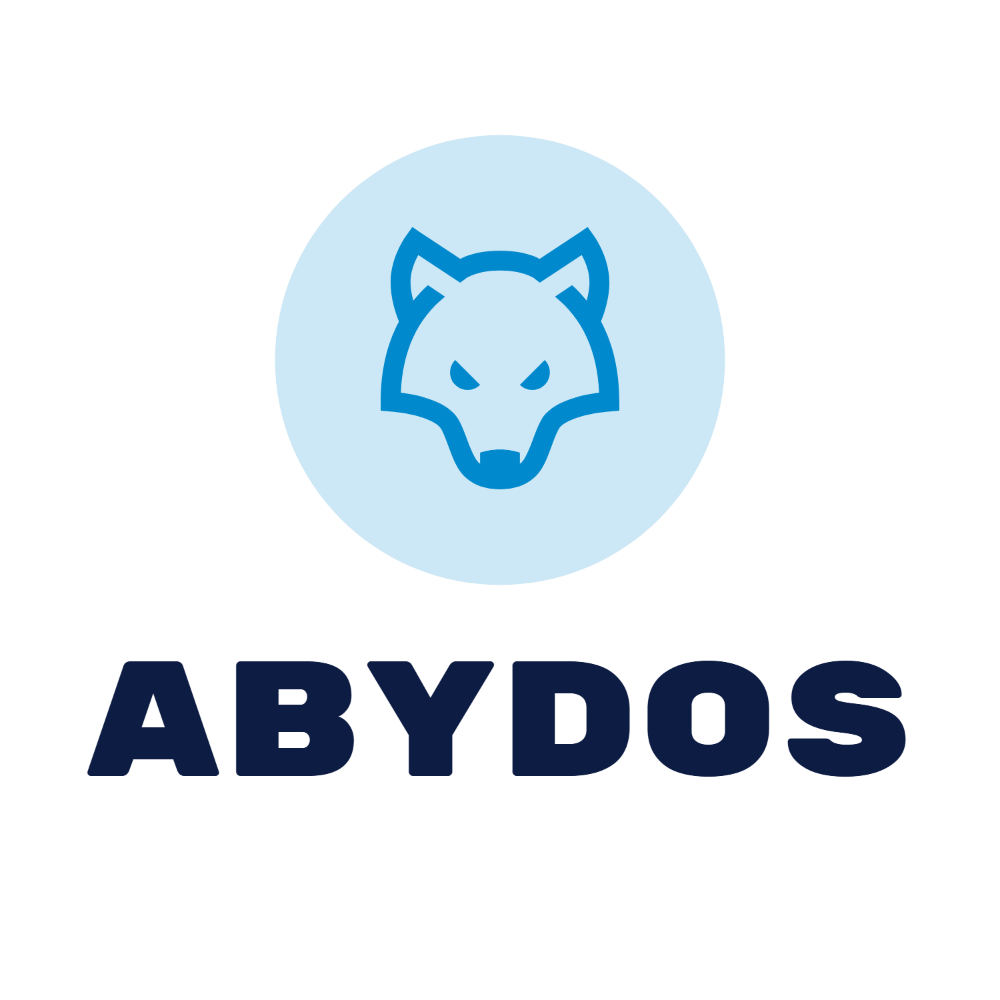

# ABYDOS

現職の案件のクラス設計・実装の振り返りやPoC検証のためのサンドボックスとしてECサイトを作成  
本リポジトリはそのバックエンド部分に該当します。

---


## 使用技術
- Java 17 (Corretto)
- Spring Boot 3.5.9
- Spring Security + JWT (java-jwt 4.2.2)
- AWS DynamoDB (Enhanced Client)
- Gradle 8.10.2
- Lombok
- Docker Compose（ローカルDynamoDB）

## 確認方法

下記手順でローカルで確認するまたは、以下のエンドポイントにアクセスして確認してください。

```shell
curl https://6wsd50jzvc.execute-api.ap-northeast-1.amazonaws.com/api/v1/products/1
```

### 前提
- dockerおよびdocker-composeをインストールしていること

```shell
git submodule init
git submodule update --recursive
./gradlew :products:bootRun --args='--spring.profiles.active=local'
```

## パッケージ構成
マルチモジュール構成を採用し、各種jarが独立して起動できるようにしております。  
サブモジュール構成にしており、リポジトリを超えて共通的に扱うモジュールは[schale](https://github.com/ecapp0226/schale)に配置してください。

| パッケージ名   | 役割                        |
|----------|---------------------------|
| common   | 各パッケージ共通で使用するクラスをまとめたパッケージ |
| users    | ECサイトを利用するユーザーや店舗を扱うAPIパッケージ |
| products | ECサイトで提供する商品情報を扱うAPIパッケージ |
| orders   | ユーザーの受注情報を扱うAPIのパッケージ     |